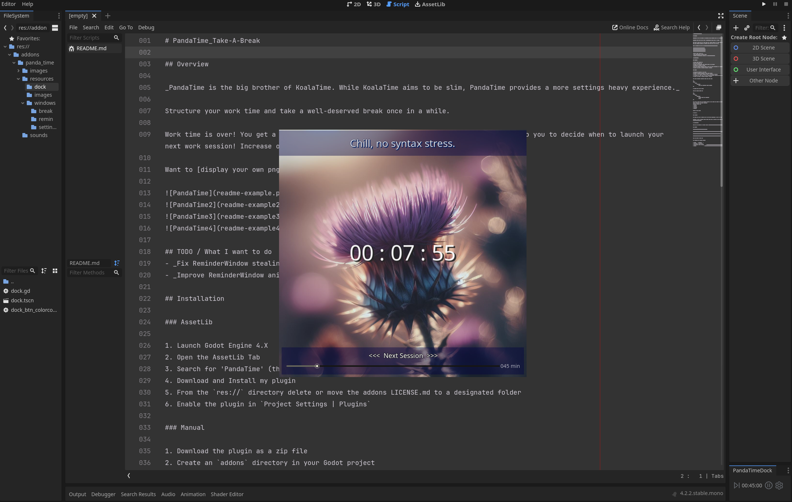
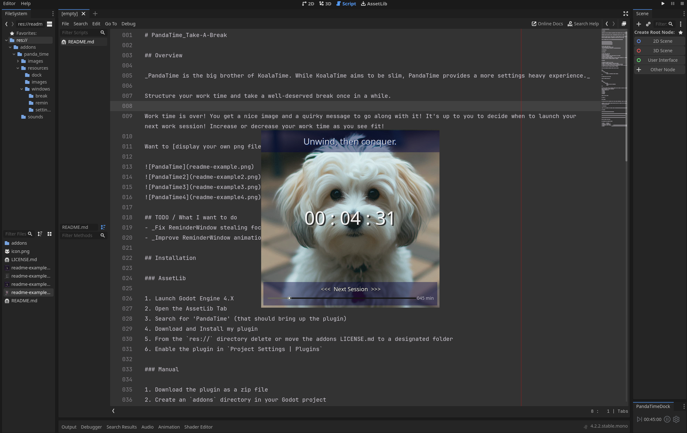
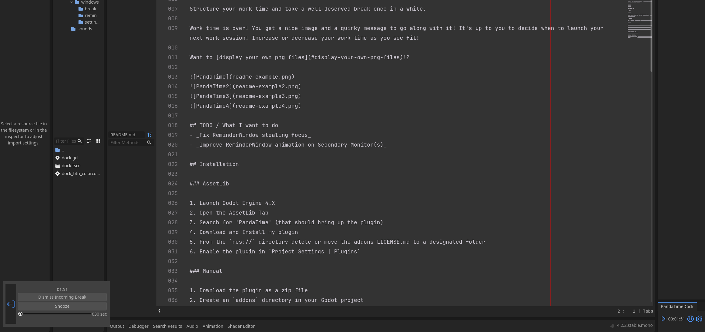
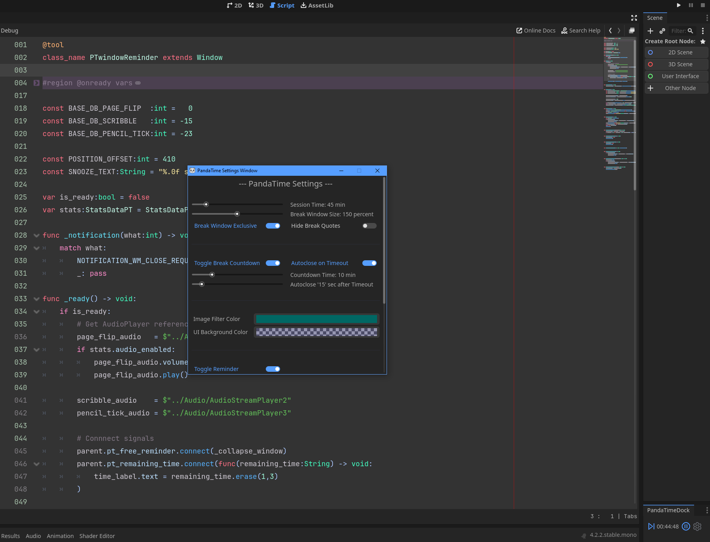

# PandaTime_Take-A-Break

**Disclaimer:** The project is currently feature complete. I'm sure there are still things to improve,
and my todo list isn't completely done either, but for the time being, I will call this project finished.
Have fun :D

## Overview

_PandaTime is the big brother of KoalaTime. While KoalaTime aims to be slim, PandaTime provides a more settings heavy experience._

Structure your work time and take a well-deserved break once in a while.

Work time is over! You get a nice image and a quirky message to go along with it! It's up to you to decide when to launch your next work session! Increase or decrease your work time as you see fit!

Want to [display your own png files](#display-your-own-png-files)!?






## TODO / What I want to do
- _Fix ReminderWindow stealing focus_
- _Improve ReminderWindow animation on Secondary-Monitor(s)_

## Installation

### AssetLib

1. Launch Godot Engine 4.X
2. Open the AssetLib Tab
3. Search for 'PandaTime' (that should bring up the plugin)
4. Download and Install my plugin
5. From the `res://` directory delete or move the addons LICENSE.md to a designated folder
6. Enable the plugin in `Project Settings | Plugins`

### Manual

1. Download the plugin as a zip file
2. Create an `addons` directory in your Godot project
3. Inside of the `addons` directory create an panda_time` directory
4. Copy/Paste all files from the zip's `addons/panda_time` directory into the equivalent projects folder
5. Enable the plugin in `Project Settings | Plugins`

Your Godot directory structure should look like this:

```
res://
	addons
		panda_time
			...all the panda_time coding files...
```

## Display your own png files

Under the images folder ...

```
res://
	addons
		panda_time
			...other files and folders...
			images
```

... copy and paste your own **image** files! You can create any amount of subfolders (subsub ... subfolders) to structure your images **inside** the images directory.
Supported formats are:
- .**png**
- .**jpg**
- .**jpeg**
- .**svg**

**Hope you like it!**

## About me

#### Cuppixx

Hey there, the name is Cuppixx (not my real name, obviously). I like to do game dev stuff, primarily working with Godot Engine.

Currently I have no (active) social media! Still want to follow me? --> Check out my (very much inactive) [Twitch](https://www.twitch.tv/cuppixd)!

## Bibliography

Check out and download the amazing [Godot Engine](https://godotengine.org/download)!

### Cuppixx

[Twitch](https://www.twitch.tv/cuppixd)

[RidiculousCodingCuppixxVersion](https://github.com/Cuppixx/RidiculousCodingCuppixxVersion/tree/main)

[KoalaTime_Take_A_Break](https://github.com/Cuppixx/KoalaTime_Take-A-Break)

[PandaTime_Take_A_Break](https://github.com/Cuppixx/PandaTime_Take-A-Break)

[TravelingSalesmanProblem_ClassProject](https://github.com/Cuppixx/TravelingSalesmanProblem_ClassProject)

More fun links to come ....

### Reference and Template Sources

| Authors    | Resources   |
| ---------- | ----------- |
| chukusuccess -Chuku Success-     | [Coding-Break-Extension](https://github.com/chukusuccess/Coding-Break-Extension) |
| Cuppixx		           | [KoalaTime_Take_A_Break](https://github.com/Cuppixx/KoalaTime_Take-A-Break)      |
